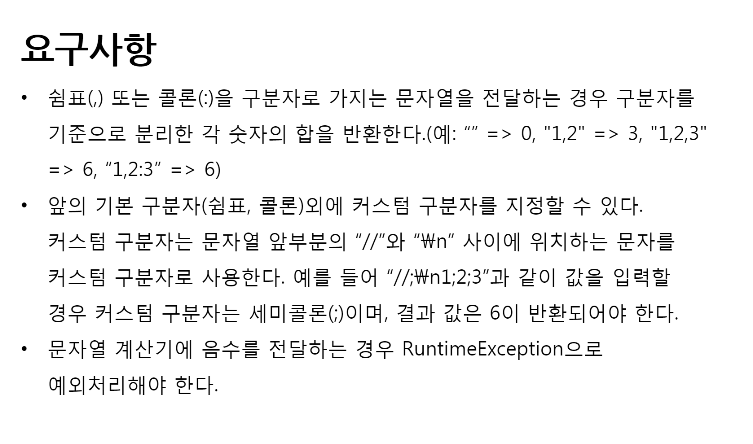

## 문자열 계산기

### 기본 요구사항
- 문자열은 `기본 구분자`와 `커스텀 구분자`로 분리할 수 있다.
- 기본 구분자는 쉼표 (,) 또는 콜론 ( : ) 이다.
- 커스텀 구분자는 문자열 앞부분의 // 와 \n 사이에 위치하는 문자이다.
- 구분자로 분리한 숫자들의 합을 반환한다.
  - 문자열 내에 공백이 존재하는 경우, 숫자 0 으로 간주한다.
  - 문자열 내에 음수가 존재하는 경우, "문자열 계산기에는 음수가 들어갈 수 없습니다" 메시지를 담은 RuntimeException 으로 예외처리한다.

### 테스트 케이스
  - [x] 커스텀 구분자가 1개인 경우
     - //;\n1;2;3 의 경우, 커스텀 구분자는 ; 이며, 6을 반환한다.
  - [ ] 커스텀 구분자가 2개 이상인 경우
     - //#\n//@\n1#2@3 인 경우, 커스텀 구분자는 # 과 @ 이며, 6을 반환한다.
  - [x] 기본 구분자도, 커스텀 구분자도 없는 경우 
  - [x] 기본 구분자가 아니고, 커스텀 구분자로 설정하지 않은 구분자가 나올 경우
     - //#\n1;2#3 인 경우, 기본 구분자도 아니고 커스텀 구분자도 아닌 ; 구분자가 나왔으므로 "기본 구분자도, 커스텀 구분자도 아닌 구분자입니다" 메시지를 담은 RuntimeException 으로 예외처리한다.
  - [x] 문자열 내에 공백이 존재하는 경우 숫자 0 으로 간주한다.
     - [x] " ,1,2" 인 경우, 3을 반환한다.
     - [x] "", " "인 경우, 0을 반환한다.
  - [ ] 문자열 내에 숫자가 존재하지 않는 경우
     - "//#\n#" 인 경우, "숫자가 존재하지 않습니다" 메시지를 담은 RuntimeException 으로 예외처리한다.
  - [ ] 문자열 내에서 구분자가 숫자보다 앞서 나오는 경우
     - "#3,1" 인 경우 "첫번째 숫자 앞에는 구분자가 존재할 수 없습니다" 메시지를 담은 RuntimeException 으로 예외처리한다.
  - [ ] 문자열 내에 음수가 존재하는 경우 
    - 커스텀 구분자가 - 가 아닌데 - 가 나온 경우
    - [x] //;\n1;-1;3 -> split 했는데 문자가 포함되지 않은 경우; 음수 예외처리한다.
    - [ ] //;\n1-1;3 인 경우 -> split 했는데 문자가 포함된 경우; 잘못된 구분자입니다 예외처리한다.
    - 기본 구분자이거나, 구분자가 없는데 - 가 나온 경우
      - -1
      - 1;2;-1
    - 커스텀 구분자 - 가 나온다고 모두 음수가 아님을 증명하는 케이스
      - //-\n-1-2-3 인 경우 - 앞의 공백을 0으로 보므로, 0+1+2+3 으로 6 을 반환한다.
      - //+\n-1+2-3 맨 첫글자에 - 가 등장하는 경우 음수 등장했으므로 예외 반환한다.
    